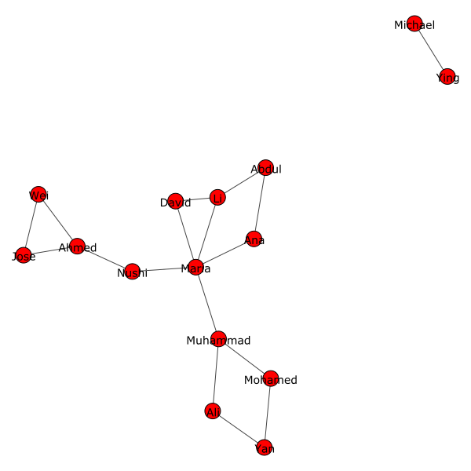

# Social Network Visualiser (snvis)

This is a tool to visualise social networks from a spreadsheet of connections.
It creates an svg image and then displays is with the default system tool.

Example:



## Installing

Requirements:
* xdg-open (Linux only)
* Python 3.9 or greater

```sh
pip install snvis
```

## Usage

Once you have installed `snvis`, you can run it using `snvis` as long as you
have added the directory it was installed to to your path. If this doesn't work,
you can run:

```sh
python -m snvis
```

The only required argument is the spreadsheet to parse, in tab-separated values
format.

An example usage would be:

```sh
snvis data.tsv -v
```

This runs on the file `data.tsv` in verbose mode so that you can see what the
program is doing.

To see all options, run:

```sh
snvis -h
```

### Data Structure

The data for the network should be in a *.tsv file. In this file, one column
should contain the name for each person in the network and a second column
should contain the names of all other people that the person is connected to.
Connections can go both ways or just one, right now they are the same.

Example spreadsheet:

| name    | connections   |
| -----   | ------------- |
| James   | Robert, John  |
| Michael |	Wiliam, David |
| Roberf  | John          |
| William | David, Robert |
| David   | Michael       |
| John    | James, roberf |

Notice that there are some typos in this spreadsheet. The program can detect
minor typos like "Roberf". One important thing to note here is that whichever
name the program sees first is the one it will use, even the first one is the
one with the typo. In the example it sees "Wiliam" before "William", so it will
think that "Wiliam" is the correct one and display it in the image.

## Contributing

### Commits

When writing commit messages, please use conventional commits.

### Building

To build a release, install build using 

```sh
pip install build
```

then to build the package, run

```sh
python -m build
```